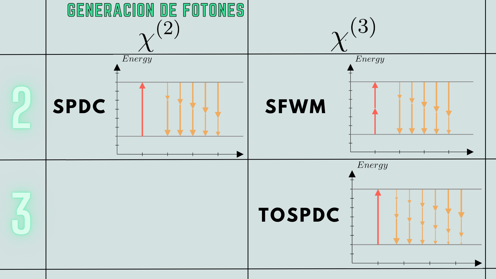
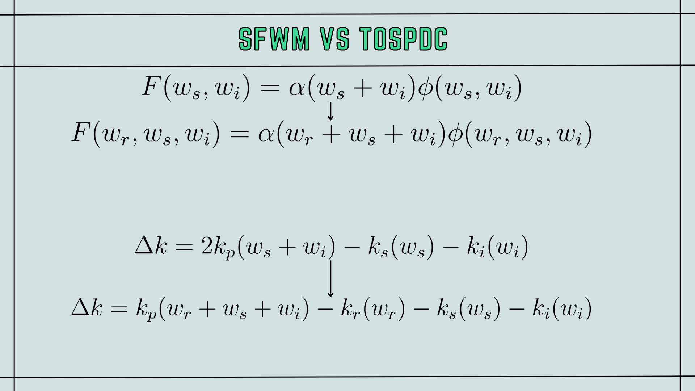

# Quantum Entangled Photon Triplets Using TOSPDC in a Waveguide

The generation of photon pairs is crucial in quantum mechanics, utilized both in quantum computers and in experiments to understand quantum theory. These pairs are created via various methods in nonlinear crystals, such as in PDC (where one photon splits into two) and in SFWM (where two photons convert into another pair).

However, generating entangled photon triplets and higher-order multiplets involves significant technological challenges. We focus on third-order spontaneous parametric down-conversion (TOSPDC) in fused silica optical fibers, where a single pump photon is annihilated to generate a photon triplet. This process is promising for heralded photon pair emission and for the direct generation of Greenberger-Horne-Zeilinger (GHZ) entangled polarization states without the need for post-selection.

This document will explore the theory behind our proposed TOSPDC photon triplet sources, focusing on the photon triplet state and the phase-matching characteristics of TOSPDC in thin optical fibers.

This document aims to provide an overview of photon pair generation in optical fibers, including a description of the two-photon state, and the optimization of waveguide dimensions for TOSPDC.

## Non-Linear Effects
There are two methods of generating photon pairs through nonlinear crystals, one considering the $\chi^{(2)}$ effect and the other the $\chi^{(3)}$ effect. The $\chi^{(2)}$ effect is called Spontaneous Parametric Down Conversion, being second-order non-linearity and the most studied. The $\chi^{(3)}$ effect of Spontaneous Four Wave Mixing has also been recently proposed, in which two photons are also generated at the expense of two pump photons. The phenomenon we will study is the third $\chi^{(3)}$ phenomenon called Third Order Spontaneous Parametric Down Conversion, referred to as (TOSPDC).

## Quantum State Derivation
Photon generation via TOSPDC follows the Hamiltonian

$\hat{H}= \frac{3}{4}\epsilon_0 \chi^{(3)} \int dV \hat{E}_p^{(+)} \hat{E}_r^{(-)} \hat{E}_s^{(-)} \hat{E}_i^{(-)}$

Where $\hat{E}^{(+)}$ and $\hat{E}^{(-)}$ are the positive and negative frequency parts of the electric field operator.

Photon generation in TOSPDC follows a formulation where the electric field for modes $r,s,i$ is expressed as a function including the wave number-dependent annihilation operator for the propagation mode in the fiber.

$\hat{E}^{(+)}(r,t) = iA(x,y)\sqrt{\delta k} \sum_k l(w) \exp{[i(kz-wt)]} \hat{a}(k)$

Pump photons are represented as a classical wave, which, when substituted (2) into Hamiltonian (1), allows deriving the state produced by TOSPDC, which can be written in terms of the three-photon component of the state $\ket{\Psi_3}$.

$\ket{\Psi} = \ket{0}_r\ket{0}_s\ket{0}_i + \xi \ket{\Psi_3}$

Where $\xi$ is the conversion efficiency.

$\xi=$
$\frac{3\epsilon_0\chi^{(3)} (2\pi)A_0(\delta k)^{3/2} L}{4\hbar}\times \int dx \int dy A_p(x,y)$

$A_r^*(x,y)$ 

$A_s^*(x,y)$

$A_i^*(x,y)$

And the state $\ket{\Psi_3}$ is described by.

$\ket{\Psi_3} = \sum_{k_r}\sum_{k_s}\sum_{k_i} G_k (k_r,k_s,k_i) \times \hat{a}^\dag(k_r)\hat{a}^\dag(k_s)\hat{a}^\dag(k_i)\ket{0}_r\ket{0}_s\ket{0}_i$

The function $G_k(k_r,k_s,k_i)$ is the joint wave number amplitude. The spectral properties of the photon triplet are determined by the joint spectral amplitude function $G_k(k_r,k_s,k_i)$, simplified to be $F(w_r,w_s,w_i)$

$F(w_r,w_s,w_i) = \alpha(w_r+w_s+w_i)\cdot\Phi(w_r,w_s,w_i)$

related to the Pump Spectral Amplitude $\alpha$ and the Phase Matching function $\Phi$.

The Phase Matching function is defined as

$\Phi = sinc[\frac{L}{2}\Delta k]\exp{[\frac{iL}{2}\Delta k]}$

where 

$\Delta k (w_r,w_s,w_i) = k_p(w_r+w_s+w_i) - k_r(w_r) - k_s(w_s) -k_i(w_i) + NL$

TOSPDC mechanism is observed in the annihilation of a pump photon for the creation of photons $k_r, k_s, k_i$. Finally, the nonlinear contribution in phase deviation, considered to be 0 for this investigation, is addressed.

Knowing the Phase Matching function of the generated photons, one can determine the joint spectral amplitude function, which provides information about the state of the three photons $\ket{\Psi_3}$.

